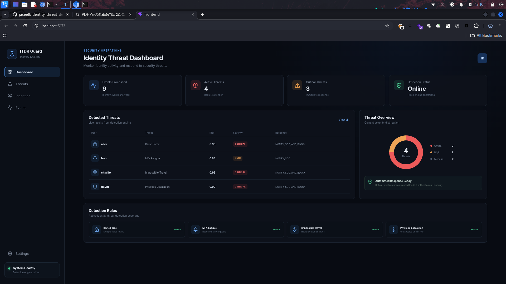

# Identity Threat Detection & Response (ITDR)

A lightweight Identity Threat Detection and Response (ITDR) MVP that analyzes identity events, detects common identity-based threats, assigns risk scores, and recommends response actions through a React security operations dashboard.

## Dashboard Preview



## Overview

This project demonstrates a rule-based approach to detecting suspicious identity activity such as brute-force login attempts, MFA fatigue, impossible travel, and privilege escalation.

The MVP consists of a FastAPI backend for event analysis and a React/Vite frontend for security monitoring and alert visualization.

## Features

- Identity event ingestion through REST API
- Rule-based threat detection
- Risk scoring and severity classification
- Brute-force detection
- MFA fatigue detection
- Impossible-travel detection
- Privilege-escalation detection
- Recommended SOC response actions
- Interactive security dashboard
- Threat details and severity overview
- Identity and event monitoring views
- Automated API-driven dashboard data
- Unit and API testing with pytest

## Detection Rules

| Threat | Detection Logic | Risk | Severity |
|---|---|---:|---|
| Brute Force | 3+ failed logins within 5 minutes | 0.90 | CRITICAL |
| MFA Fatigue | 3+ MFA requests within 5 minutes | 0.85 | HIGH |
| Impossible Travel | Successful logins from different locations within 10 minutes | 0.95 | CRITICAL |
| Privilege Escalation | User role changed to admin | 0.90 | CRITICAL |

## Response Actions

| Severity | Recommended Action |
|---|---|
| CRITICAL | Notify SOC and block |
| HIGH | Notify SOC |
| MEDIUM | Monitor |
| LOW | No action |

## Architecture

```text
Identity Events
      |
      v
FastAPI REST API
      |
      v
Threat Detection Engine
      |
      +--> Rule Evaluation
      |
      +--> Risk Scoring
      |
      +--> Severity Classification
      |
      v
Response Recommendation
      |
      v
React Security Dashboard 
```
## Project Structure

```text
identity-threat-detection/
├── app/
│   ├── main.py
│   ├── models.py
│   ├── detector.py
│   ├── database.py
│   └── response.py
├── frontend/
├── sample_data/
│   └── identity_events.json
├── tests/
│   ├── test_detection.py
│   ├── test_api.py
│   └── test_response.py
├── dashboard.png
├── pytest.ini
├── requirements.txt
└── README.md
```
## Backend Setup

Clone the repository and install the backend dependencies:

```bash
git clone git@github.com:jaseell/identity-threat-detection.git
cd identity-threat-detection

python3 -m venv .venv
source .venv/bin/activate

pip install -r requirements.txt
```
## FastAPI server:
```
uvicorn app.main:app --reload

API:
http://127.0.0.1:8000
```
## Health check:
```
curl http://127.0.0.1:8000/health
```

## API
```
Analyze Identity Events
POST /v1/events
```

The API accepts identity events and returns detected threats, risk scores, severity levels, and recommended response actions.
Frontend Setup
## Install and start the React frontend:
```
cd frontend
npm install
npm run dev
```

## Frontend:
```
http://localhost:5173
```
## Testing
```
Run the backend test suite:
pytest
```
## Technology Stack

- Python
- FastAPI
- Pydantic
- pytest
- React
- Vite
- JavaScript
- CSS
- Lucide React
- SQLite-ready architecture

## Scope and Limitations

This is a lightweight MVP demonstrating identity threat detection, rule-based analytics, risk scoring, response recommendations, and SOC-style visualization.
It does not include production integrations with Azure AD/Entra ID, Okta, Kafka/Kinesis, Neo4j, Elasticsearch, or machine-learning anomaly detection.

Author
Muhammed Jaseel K

